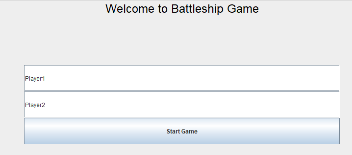
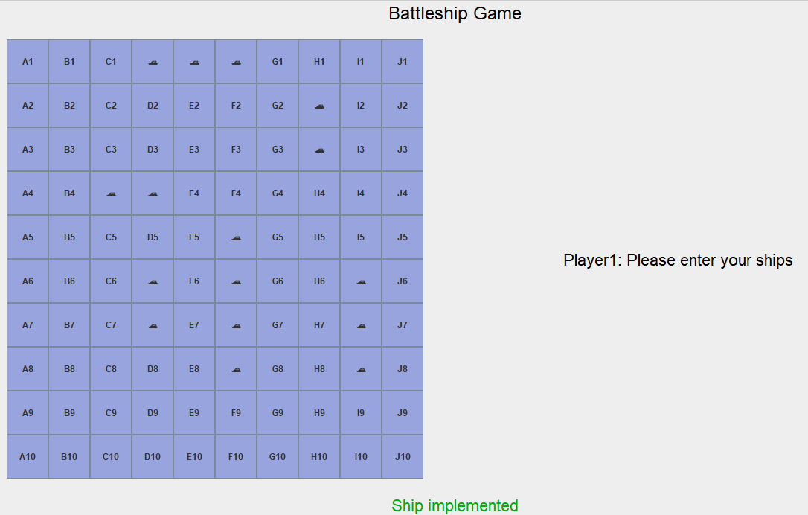
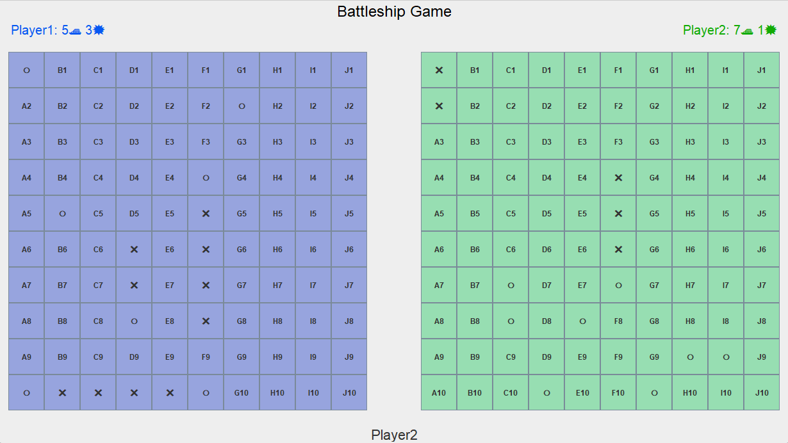

# Battleship Game

---

## Contributors

[Julian Böhne](https://github.com/julianboehne) | [Fabian Meyer](https://github.com/Nerbry72)

## Description
This is a implementation of the battleship-game. 2 Player can play against each other in a 10x10 battleship field.

## How to Play

### Enter your name

If you don't enter a name you will get an automatic generated player-name

### Enter your ships

You can place four different sized ships.

You also have the possibility to auto-place your ships in the menu-bar.

### Play and enjoy

Now you can start playing battleship-game.

